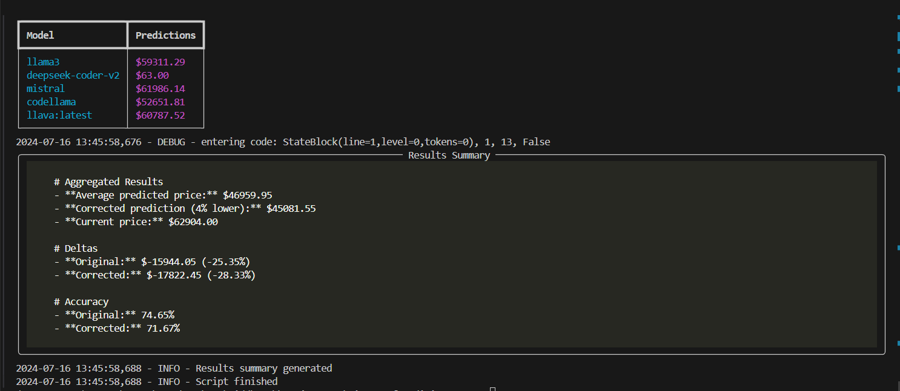

# 🔮 Mixture of Predictive Agents for Bitcoin Price Forecasting

## 📊 Overview

This project implements a mixture of predictive agents to forecast Bitcoin prices. It utilizes various language models through Ollama to generate predictions based on historical price data and current market conditions.

Here's a sample of what the output looks like:

## ✨ Features

- 💰 Fetches current Bitcoin price from CoinGecko API
- 📅 Uses historical Bitcoin price data (30 days) for trend analysis
- 🤖 Employs multiple language models for diverse predictions:
  - llama3
  - deepseek-coder-v2
  - mistral
  - codellama
  - qween2
  - llava:latest
- 🧮 Aggregates predictions and provides summary statistics
- 🛠️ Implements error handling and logging for robustness

## 🚀 Prerequisites

- Python 3.7+
- Ollama installed and configured
- Required Python packages (install via `pip install -r requirements.txt`):
  - dotenv
  - requests
  - rich

The script will fetch the current Bitcoin price, use various models to make predictions, and display the results in a formatted table along with summary statistics.

## 📈 Output

The script provides:
- Current Bitcoin price
- Individual model predictions
- A summary table of all predictions
- Aggregated results including:
  - Average predicted price
  - Corrected prediction (4% lower)
  - Price deltas and accuracy percentages

## 📝 Logging

The script logs its operations to a file for debugging and monitoring purposes. Check the log file for detailed information about each run.

## 🤝 Contributing

Contributions are welcome! Please feel free to submit a Pull Request.

## ⚠️ Disclaimer

This tool is for educational and research purposes only. Do not use it for actual trading or financial decisions. Always consult with a qualified financial advisor before making investment decisions.
